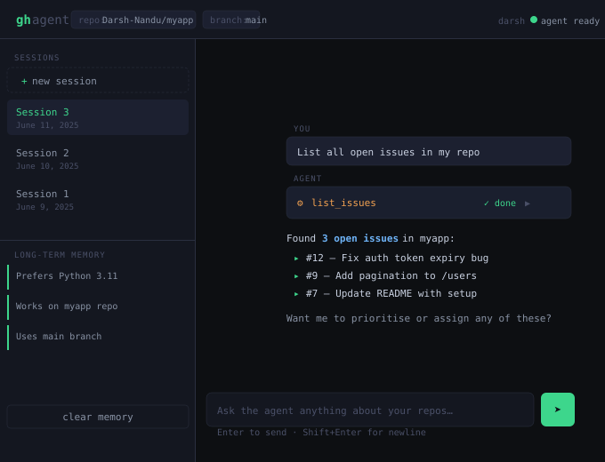
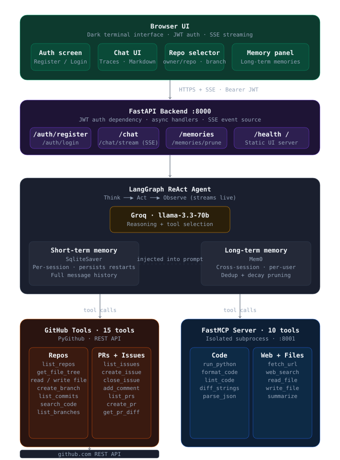

<div align="center">


<br/>

[](https://github.com/Darsh-Nandu/React-Github-Agent/actions/workflows/ci.yml)
&nbsp;

&nbsp;

&nbsp;

&nbsp;

&nbsp;

&nbsp;


<br/><br/>

> An autonomous AI agent that manages your GitHub repositories through natural language.
> Talk to it. It thinks, picks tools, executes them, observes results, and keeps going -
> streaming every step live in your browser.

<br/>

[**Quick Start**](#-quick-start) &nbsp;·&nbsp;
[**Architecture**](#-architecture) &nbsp;·&nbsp;
[**Tools**](#-tools) &nbsp;·&nbsp;
[**Auth**](#-authentication) &nbsp;·&nbsp;
[**Memory**](#-memory-system) &nbsp;·&nbsp;
[**API**](#-api-reference) &nbsp;·&nbsp;
[**Testing**](#-testing) &nbsp;·&nbsp;
[**Docker**](#-docker)

</div>

---

## ✦ What It Does

Describe a task. The agent reasons about which tool calls to make, executes them in sequence, and streams every thought and action live.

```
You   ──▶  "Review open PRs in my repo and post a diff summary on each"

          ╭─ think ─────────────────────────────────────────────────────╮
          │  I need to list PRs, fetch each diff, then post a comment.  │
          ╰─────────────────────────────────────────────────────────────╯
Agent ──▶  ⚙  list_pull_requests("owner/repo")          ✓ done
      ──▶  ⚙  get_pr_diff("owner/repo", 12)             ✓ done
      ──▶  ⚙  add_issue_comment("owner/repo", 12, …)    ✓ done
      ──▶  ⚙  get_pr_diff("owner/repo", 13)             ✓ done
      ──▶  ⚙  add_issue_comment("owner/repo", 13, …)    ✓ done
      ──▶  "Done - posted diff summaries on PR #12 and PR #13."
```

It remembers your name, preferred style, and project context across sessions.

---

## 🖥 UI Preview

<div align="center">
  
</div>

<br/>

The dark terminal interface shows the active session, long-term memory in the sidebar, collapsible tool traces (`⚙ list_issues  ✓ done`), and the agent's formatted response - all streamed live token by token.

---

## ◈ Architecture

<div align="center">
  
</div>

<br/>

Four tiers, two processes. The **FastMCP server** and **FastAPI backend** run independently - a crashing tool never takes down the agent. Docker Compose wires them together with healthchecks and a shared volume for SQLite persistence.

| Tier | What it does |
|:---|:---|
| **Browser UI** | Auth screen, chat interface, active repo selector, collapsible tool traces, memory panel |
| **FastAPI :8000** | JWT auth, SSE streaming, REST endpoints, serves the static UI |
| **LangGraph Agent** | ReAct loop with SqliteSaver (short-term) + Mem0 (long-term, cross-session) |
| **Tools** | 15 GitHub tools via PyGithub + 10 utility tools via FastMCP on :8001 |

---

## ⚡ Quick Start

**Prerequisites**

| | | Notes |
|:---:|:---|:---|
| 🐍 | Python 3.10+ | 3.11 recommended |
| ⚡ | [Groq API key](https://console.groq.com/) | Free tier works |
| 🐙 | [GitHub Token](https://github.com/settings/tokens) | `repo` + `workflow` scopes |
| 🧠 | OpenAI key | Optional - semantic memory search |

**1 · Clone and install**

```bash
git clone https://github.com/Darsh-Nandu/React-Github-Agent.git
cd React-Github-Agent

python -m venv .venv
source .venv/bin/activate        # Windows: .venv\Scripts\activate

pip install -r requirements.txt
```

**2 · Configure**

```bash
cp .env.example .env
# Fill in GITHUB_TOKEN, GROQ_API_KEY, AUTH_SECRET_KEY
```

**3 · Start the MCP tool server** *(Terminal 1)*

```bash
python mcp_server/server.py
# FastMCP on http://localhost:8001
```

**4 · Start the agent backend** *(Terminal 2)*

```bash
python main.py
# FastAPI on http://localhost:8000
```

**5 · Open the UI**

Go to **http://localhost:8000** - register an account and start chatting.

---

## 🐳 Docker

One command. No Python setup required.

```bash
cp .env.example .env        # fill in your keys
docker compose up --build
# open http://localhost:8000
```

Both servers start automatically. The agent waits for MCP to pass its healthcheck before initialising. SQLite is persisted to a named Docker volume so sessions survive container restarts.

---

## 🔐 Authentication

JWT-based. Each user has isolated memory and session history.

```bash
# Register - returns access_token
curl -X POST http://localhost:8000/auth/register \
  -H "Content-Type: application/json" \
  -d '{"username": "alice", "password": "secret"}'

# Use the token on every request
curl -X POST http://localhost:8000/chat/stream \
  -H "Authorization: Bearer <token>" \
  -H "Content-Type: application/json" \
  -d '{"message": "List my repos", "active_repo": "alice/my-project"}'
```

Set `AUTH_ENABLED=false` in `.env` to skip auth entirely during local development.

---

## 🛠 Tools

### 🐙 GitHub - 15 tools

| Tool | Description |
|:---|:---|
| `list_repos` | List all repos, filter by visibility |
| `get_file_tree` | Browse directory structure on any branch |
| `read_github_file` | Read any file from any branch |
| `write_github_file` | Create or update a file with a commit |
| `create_branch` | Create a branch from any source ref |
| `list_branches` | List all branches in a repo |
| `list_commits` | Recent commits on any branch |
| `search_code` | GitHub code search syntax |
| `list_issues` | List open or closed issues |
| `create_issue` | Open an issue with title, body, labels |
| `add_issue_comment` | Post a comment on any issue or PR |
| `close_issue` | Close an issue by number |
| `list_pull_requests` | List open or merged PRs |
| `create_pull_request` | Open a PR between two branches |
| `get_pr_diff` | Full unified diff of any PR |

### ⚙️ MCP - 10 tools

| Tool | Description |
|:---|:---|
| `run_python` | Execute Python in an isolated subprocess (timeout-safe) |
| `format_python_code` | Auto-format with Black |
| `lint_python_code` | Lint with Pylint, returns issue list |
| `fetch_url` | Fetch any URL as clean plain text |
| `web_search` | DuckDuckGo search - no API key needed |
| `read_local_file` | Read from the local filesystem |
| `write_local_file` | Overwrite a local file |
| `summarize_text` | Extractive summarization of long content |
| `parse_json` | Parse and pretty-print JSON |
| `diff_strings` | Unified diff between two strings |

---

## 🧠 Memory System

Two-layer architecture - short-term for within-session continuity, long-term for facts that survive across sessions.

```
Each user message
  │
  ├── 1. recall_memories(user_id, query)
  │         Semantic search in Mem0
  │         Top-5 facts injected into system prompt
  │
  ├── 2. ReAct loop
  │         SqliteSaver keeps full message history
  │         Survives server restarts
  │
  └── 3. _maybe_save_memory(exchange)
            LLM extracts key facts
            Dedup - skip if 85%+ similar to existing
            Persisted to Mem0 with timestamp
            Pruned after MEMORY_DECAY_DAYS (default 90)
```

| | Store | Scope | Backend |
|:---:|:---|:---|:---|
| Short-term | SqliteSaver | Per session | SQLite - survives restarts |
| Long-term | Mem0 | Per user, cross-session | Vector store or file fallback |

---

## 📡 API Reference

| Method | Endpoint | Auth | Description |
|:---|:---|:---:|:---|
| `POST` | `/auth/register` | | Create account, receive JWT |
| `POST` | `/auth/login` | | Login, receive JWT |
| `POST` | `/chat` | ✓ | Single-turn, full response |
| `POST` | `/chat/stream` | ✓ | Streaming SSE, token by token |
| `GET` | `/memories` | ✓ | All long-term memories for the user |
| `DELETE` | `/memories` | ✓ | Wipe all memories |
| `DELETE` | `/memories/prune` | ✓ | Remove memories older than decay threshold |
| `GET` | `/health` | | Server status + agent readiness |
| `GET` | `/` | | Serves the browser UI |

**Chat request body**

```json
{
  "message": "Review my open PRs and add a summary comment to each",
  "session_id": "optional-uuid-for-continuity",
  "active_repo": "owner/repo",
  "active_branch": "main"
}
```

**SSE stream format**

```
event: session   data: <session_id>
event: token     data: Hello, I will start by listing your pull requests.
event: token     data: ⚙️ *Using tool: `list_pull_requests`*
event: token     data: ✅ *`list_pull_requests` done*
event: done      data:
```

---

## 🧪 Testing

```bash
pip install -r requirements-dev.txt

# 69 tests - no API keys, no network, everything mocked
pytest

# With coverage report
pytest --cov=agent --cov=github_tools --cov=mcp_server --cov-report=term-missing
```

| File | Covers |
|:---|:---|
| `test_github_toolkit.py` | All 15 GitHub tools - happy paths + error handling |
| `test_memory.py` | SqliteSaver fallback, Mem0 save / recall / prune / dedup |
| `test_api.py` | All endpoints, JWT auth, 503 guard, request validation |
| `test_agent_graph.py` | Prompt building, repo context injection, streaming events |

---

## 📁 Project Structure

```
React-Github-Agent/
│
├── main.py                     # FastAPI - routes, JWT, SSE, lifespan
├── auth.py                     # JWT register / login / dependency
│
├── agent/
│   ├── graph.py                # LangGraph ReAct loop + repo context + async memory
│   ├── memory.py               # SqliteSaver + Mem0 + dedup + decay pruning
│   └── state.py                # AgentState TypedDict
│
├── github_tools/
│   └── github_toolkit.py       # 15 GitHub tools via PyGithub
│
├── mcp_server/
│   └── server.py               # FastMCP server - 10 utility tools
│
├── static/
│   └── index.html              # Dark UI - auth, repo selector, collapsible traces
│
├── docs/
│   ├── architecture.svg        # Architecture diagram
│   └── ui-preview.svg          # UI screenshot mockup
│
├── tests/
│   ├── conftest.py
│   ├── test_github_toolkit.py
│   ├── test_memory.py
│   ├── test_api.py
│   └── test_agent_graph.py
│
├── .github/workflows/ci.yml    # Test matrix · lint · security scan
├── Dockerfile                  # Agent backend image
├── Dockerfile.mcp              # MCP server image
├── docker-compose.yml          # One-command startup
├── .env.example                # All env vars documented
├── pyproject.toml              # Metadata + pytest + black + coverage
├── requirements.txt
├── requirements-dev.txt
├── CONTRIBUTING.md
└── LICENSE
```

---

## 🗺 Roadmap

```
✅  LangGraph ReAct loop with live streaming
✅  25 tools - 15 GitHub + 10 MCP
✅  Dual memory - SqliteSaver + Mem0
✅  Memory deduplication + decay pruning
✅  FastAPI backend with SSE streaming
✅  Dark terminal UI with collapsible tool traces
✅  JWT auth - per-user session isolation
✅  Active repo / branch context injection
✅  69-test suite - fully mocked, zero network calls
✅  CI pipeline - matrix (3.10-3.12), lint, security scan
✅  Docker Compose - one-command startup
✅  MIT License · .env.example · CONTRIBUTING guide

⬜  SqliteSaver → RedisSaver for multi-instance deploys
⬜  Syntax highlighting in code blocks
⬜  Persistent repo selector - saved per session
⬜  Webhook support - trigger agent on push / PR events
⬜  Rate limiting per user
```

---

## 🧰 Tech Stack

<div align="center">

| | Library | Purpose |
|:---:|:---|:---|
| 🔗 | [LangGraph](https://github.com/langchain-ai/langgraph) | ReAct loop + SqliteSaver checkpointing |
| 🦜 | [LangChain](https://github.com/langchain-ai/langchain) | LLM interface, tool binding, messages |
| ⚡ | Groq · `llama-3.3-70b-versatile` | Fast inference - free tier available |
| 🛠️ | [FastMCP](https://github.com/jlowin/fastmcp) | MCP tool server over SSE |
| 🐙 | [PyGithub](https://github.com/PyGithub/PyGithub) | GitHub REST API |
| 🧠 | [Mem0](https://github.com/mem0ai/mem0) | Long-term memory with semantic search |
| 🚀 | [FastAPI](https://fastapi.tiangolo.com/) | Async backend + SSE streaming |
| 🔐 | [python-jose](https://github.com/mpdavis/python-jose) | JWT auth |
| 🐳 | Docker Compose | One-command deployment |

</div>

---

<div align="center">


**MIT License** &nbsp;·&nbsp; Built by [Darsh Nandu](https://github.com/Darsh-Nandu)

<br/>

If this project helped you, consider giving it a ⭐

</div>